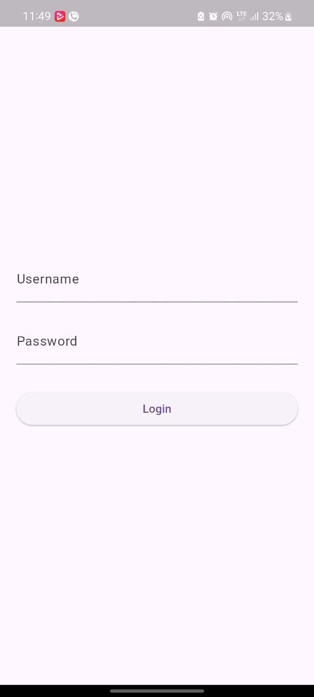
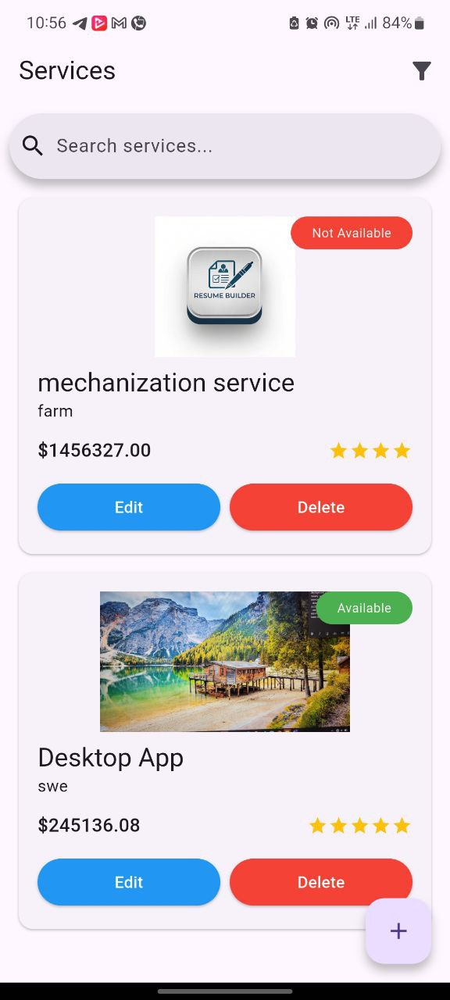
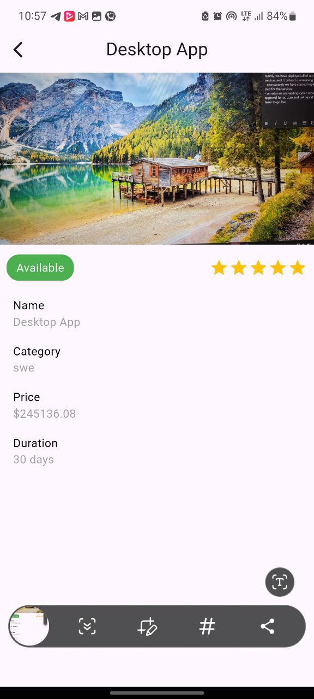
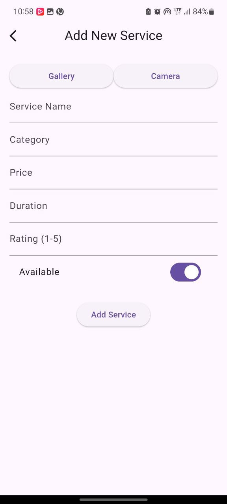
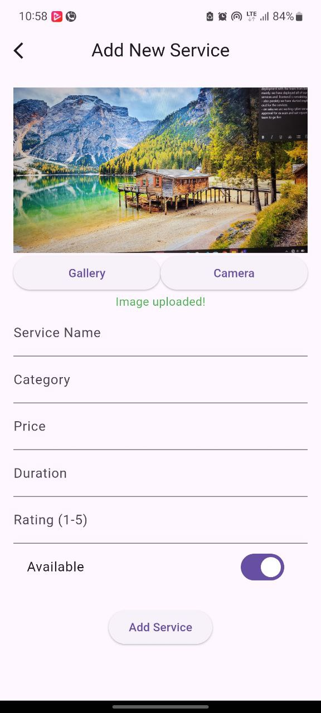
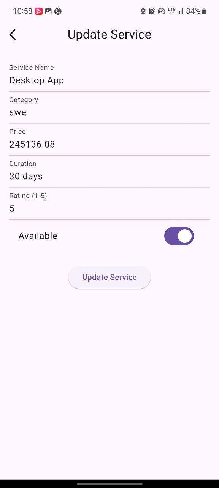
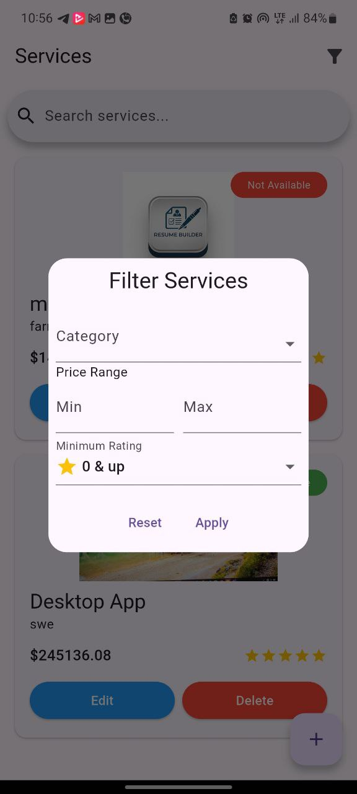

# Mini Service Booking App 🛠️

A Flutter-based application for managing service bookings with full CRUD functionality, built following Clean Architecture principles and powered by GetX for state management.

## Features ✨

### Core Functionality
- **Service List View**  
  Browse services with beautiful cards showing key details and availability status
- **Service Details**  
  Comprehensive view with expandable sections and hero animations
- **Add New Service**  
  Form with image upload (camera/gallery) and real-time validation
- **Edit Service**  
  Pre-filled forms with existing data and seamless updates
- **Delete Service**  
  Secure deletion with confirmation dialog and undo capability

### Bonus Features 🚀
- **Smart Search & Filters**  
  Combined search by name/category + filter by price range (₹100-₹5000) and rating (⭐1-⭐5)
- **Lottie Animations**  
  Custom loading sequences and empty state illustrations
- **Swipe-to-Refresh**  
  Pull down to refresh service list with haptic feedback
- **Login**
  - Credential validation (username/password)
  - Session persistence using SharedPreferences
  - Secure password obscuring
 

## Tech Stack 💻

| Category             | Technologies                                                              |
|----------------------|---------------------------------------------------------------------------|
| **Framework**        | Flutter                                                                   |
| **State Management** | GetX                                                                      |
| **API Client**       | Dio with Interceptors                                                     |
| **Image Handling**   | Cloudinary + Image Picker                                                 |
| **Local Storage**    | SharedPreferences                                                         |
| **Animations**       | Lottie                                                                    |
| **DI**               | GetX Dependency Injection 

## Architecture 🏗️

The application follows Clean Architecture principles with clear separation of concerns across three primary layers:

### Layer Structure

```text
lib/
├── core/
│   ├── constants/      # App-wide constants (strings, endpoints, etc.)
│   ├── errors/         # Custom exceptions & failures
│   ├── network/        # Dio client configuration
│   └── utils/          # Extensions, helpers, utilities
├── data/
│   ├── datasources/    # API and local data sources
│   ├── models/         # Data Transfer Objects (DTOs)
│   └── repositories/   # Repository implementations
├── domain/
│   ├── entities/       # Business logic objects
│   ├── repositories/   # Abstract repository contracts
│   └── usecases/       # Business use cases
└── presentation/
│   ├── bindings/       # Dependency injection setup
│   ├── controllers/    # GetX controllers
│   ├── pages/          # Screen widgets
│   └── widgets/        # Reusable components


## Setup 🚀
1. Clone repository
```bash
git clone https://github.com/your-username/mini-service-booking.git
```
2. Open the project on code editor
3. Install dependencies
```bash
flutter pub get
```
4. Run the app
```bash
flutter run
```

## App Preview 📱

### Services List


### Services List


### Services Detail


### Add Service Form
|  |  |

### Update Service


### Filter Service



